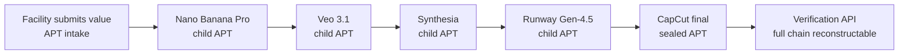
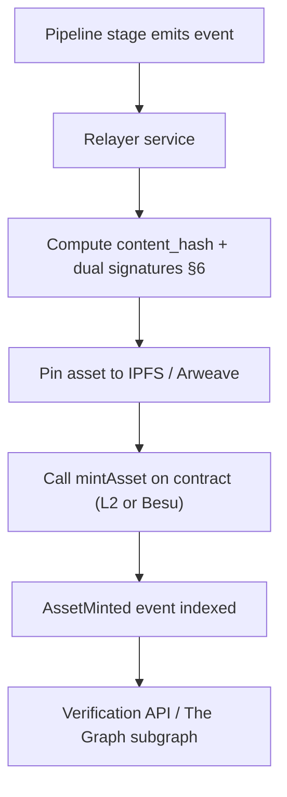

# APAD Media Pipeline — Blockchain Tokenization Layer
### Technical Architecture Specification v1.0

**Purpose:** Define a tokenization layer that tags every advertisement value (creative asset, metric, dataset) as it enters and moves through the APAD media pipeline, binding each value to a verifiable identity (the person or facility that sent it) and producing an immutable, tamper-evident chain of custody from intake to final render.

**Scope of this document:** Two parallel implementation paths — a **custom-built ledger** and an **Ethereum-based** approach — plus a **quantum-proof dual-authentication layer** that can sit on top of either.

---

## 1. Design Goals

The system is fundamentally a **provenance and attribution engine**, not a payment system. That distinction matters: it keeps you clear of most token/securities regulation and avoids the HIPAA exposure that comes with putting financial or clinical data on a public chain.

Four concrete goals:

1. **Identity binding** — every value entering the pipeline is cryptographically tied to its source (person or facility).
2. **Integrity** — any change to a value after submission is detectable.
3. **Lineage** — the full transformation history (Nano Banana Pro → Veo 3.1 → Synthesia → Runway Gen-4.5 → CapCut) is reconstructable for any final asset.
4. **Verifiability** — a third party can confirm "this value came from this source and was not altered" without trusting APAD's word for it.

---

## 2. Core Concept — The Provenance Token Model

Each value is wrapped in an **Advertisement Provenance Token (APT)**. The token does **not** contain the asset itself — it contains a fingerprint of it plus the metadata that makes it verifiable. The heavy media stays in object storage; the token is small and portable.

### 2.1 Token Record Schema

```jsonc
{
  "token_id":        "apt_7f3a9c...",        // unique identifier
  "content_hash":    "sha3-512:9b2e...",     // fingerprint of the actual asset/data
  "parent_token_id": "apt_1c08d4...",        // null at intake; set on each transformation
  "source_id":       "fac_oasis_0421",       // registered person/facility
  "stage":           "nano_banana_pro",      // pipeline stage that produced this token
  "transform_meta":  { "tool": "...", "params": {...} },
  "timestamp":       "2026-06-19T18:04:22Z",
  "sig_classical":   "ed25519:...",          // factor 1 (see §6)
  "sig_pqc":         "ml-dsa-65:...",         // factor 2 — quantum-proof (see §6)
  "ledger_anchor":   "merkleRoot:0x...",      // batch root for tamper evidence
  "schema_version":  "1.0"
}
```

The `parent_token_id` field is what turns isolated tokens into a **lineage tree**: the CapCut output token points back to its Runway parent, which points to Synthesia, and so on, all the way to the original facility submission.

### 2.2 Lineage as a DAG



---

## 3. Architecture A — Custom-Built Ledger

A private, permissioned, append-only ledger. No public chain, no gas, no consensus network — you control everything. This is the **low-latency, HIPAA-friendly** option.

### 3.1 Components

| Component | Responsibility |
|---|---|
| **Ingestion Gateway** | Intercepts values at the pipeline entry point; triggers tokenization |
| **Tokenizer Service** | Computes `content_hash`, assigns `token_id`, captures attribution |
| **Identity Registry** | Maps each `source_id` to its registered public key(s) |
| **Signature Verifier** | Confirms submissions are signed by the claimed source |
| **Provenance Ledger** | Hash-linked, append-only log (a "blockchain-lite") |
| **Merkle Batcher** | Batches records, computes a Merkle root per batch for tamper evidence |
| **Public Anchor (optional)** | Periodically writes the Merkle root to a public chain for external trust |
| **Verification API** | Reconstructs and validates any token's full lineage |
| **Pipeline Hooks** | At each stage, append a child token recording the transformation |

### 3.2 How tamper-evidence works without a full blockchain

Each ledger entry stores the hash of the previous entry (a hash-linked log). Records are batched, and each batch produces a **Merkle root**. Change any record and its hash changes, which breaks the link and invalidates the Merkle root. Periodically anchoring that root to a public chain (Ethereum L2, Bitcoin via OpenTimestamps, etc.) means even *you* can't silently rewrite history — the anchored root is your external proof.

### 3.3 Tokenizer logic (pseudocode)

```python
def tokenize(value, source_id, stage, parent=None):
    content_hash = sha3_512(value.bytes)
    record = {
        "token_id": new_id(),
        "content_hash": content_hash,
        "parent_token_id": parent,
        "source_id": source_id,
        "stage": stage,
        "timestamp": now_utc(),
    }
    # Identity binding: source signs the canonical record
    record["sig_classical"] = source.sign_ed25519(canonical(record))
    record["sig_pqc"]       = source.sign_mldsa(canonical(record))   # §6

    assert identity_registry.verify(source_id, record)   # reject unknown/forged sources
    ledger.append(record)            # hash-linked
    merkle_batcher.add(record)       # tamper-evidence
    return record["token_id"]
```

### 3.4 Suggested stack

- **Service layer:** Python (FastAPI) or Node.js (NestJS)
- **Hashing:** SHA3-512 or BLAKE3 (Grover-resistant sizing — see §6)
- **Storage:** append-only log + PostgreSQL for indexed lookups; content-addressed object store (S3 / MinIO) for the assets themselves
- **Anchoring:** OpenTimestamps or an Ethereum L2 contract call on a schedule (e.g., hourly)

### 3.5 Trade-offs

**Strengths:** full control, near-zero per-token cost, low latency, private by default (no PHI ever leaves your boundary), no token/securities regulatory baggage.
**Weaknesses:** you carry the entire security and availability burden; "immutability" is only as strong as your anchoring discipline; no native third-party decentralization unless you anchor.

---

## 4. Architecture B — Ethereum-Based

Provenance recorded on-chain via smart contracts. The asset never goes on-chain — only its hash and metadata. This is the **maximum-verifiability, externally-trusted** option.

### 4.1 Critical design rule

**Never put the asset (or any PHI) on-chain.** Store media off-chain (IPFS / Arweave / S3), and put only the `content_hash` + minimal metadata on-chain. On a public chain, anything written is permanent and world-readable — a HIPAA non-starter for clinical content.

### 4.2 Chain selection

Ethereum mainnet is too expensive and too slow for per-asset writes. Realistic options:

- **L2 rollup (Base, Arbitrum, Optimism, Polygon):** cheap, fast, inherits Ethereum security. Good default.
- **Permissioned EVM (Hyperledger Besu, Polygon CDK):** private, no public data exposure, EVM-compatible. Best fit for healthcare-adjacent data — you get smart-contract verifiability without publishing anything to the world.

### 4.3 Contracts

1. **IdentityRegistry** — maps a facility/person to its on-chain address(es) and public keys. Only registered addresses can mint.
2. **ProvenanceToken (ERC-721)** — one NFT per unique value. Token metadata URI points to off-chain content + hash. Each token is immutable and uniquely owned/attributed.
3. **LineageRecorder** — records each transformation as an event, linking child token → parent token.

### 4.4 Solidity sketch

```solidity
// SPDX-License-Identifier: MIT
pragma solidity ^0.8.24;

contract ProvenanceToken {
    struct Asset {
        bytes32 contentHash;   // sha3-512 truncated or stored as two slots
        uint256 parentId;      // 0 = intake
        bytes32 sourceId;      // registered facility/person
        string  stage;         // pipeline stage
        uint64  timestamp;
    }

    mapping(uint256 => Asset) public assets;
    mapping(bytes32 => bool)  public registeredSource;
    uint256 public nextId;

    event AssetMinted(uint256 indexed id, bytes32 indexed sourceId, uint256 parentId, string stage);

    modifier onlyRegistered(bytes32 sourceId) {
        require(registeredSource[sourceId], "unregistered source");
        _;
    }

    function mintAsset(
        bytes32 contentHash,
        uint256 parentId,
        bytes32 sourceId,
        string calldata stage
    ) external onlyRegistered(sourceId) returns (uint256 id) {
        id = ++nextId;
        assets[id] = Asset(contentHash, parentId, sourceId, stage, uint64(block.timestamp));
        emit AssetMinted(id, sourceId, parentId, stage);
    }

    function verifyChain(uint256 id) external view returns (uint256[] memory lineage) {
        // walk parentId pointers back to intake
        uint256 count; uint256 cursor = id;
        while (cursor != 0) { count++; cursor = assets[cursor].parentId; }
        lineage = new uint256[](count);
        cursor = id;
        for (uint256 i; i < count; i++) { lineage[i] = cursor; cursor = assets[cursor].parentId; }
    }
}
```

> **Note on quantum-proofing Ethereum:** Ethereum signs transactions with secp256k1 (ECDSA), which is *not* quantum-safe and you cannot replace it at the protocol level. The fix is to carry your own hybrid signatures (§6) **inside** the transaction payload / token metadata, verified by your contract or off-chain verifier — so the provenance proof survives even if the chain's own signatures are someday broken.

### 4.5 Off-chain relayer flow



### 4.6 Trade-offs

**Strengths:** strong external verifiability, immutable by design, mature tooling (ethers.js, The Graph, OpenZeppelin), credible third-party trust.
**Weaknesses:** gas/throughput cost (mitigated by L2), block-time latency, public-data exposure risk on public chains (mitigated by permissioned EVM + off-chain storage), key-management burden, and native signatures aren't quantum-safe.

---

## 5. Pipeline Integration Map

The tokenization layer hooks each stage of your existing stack. Every stage consumes the parent token and emits a child token, so the final CapCut export carries the entire verifiable history.

| Stage | Action | Token event |
|---|---|---|
| **Intake** (facility/person) | Sign + submit value | Mint intake APT (identity-bound) |
| **Nano Banana Pro** | Image generation | Child APT, parent = intake |
| **Veo 3.1** | Video generation | Child APT |
| **Synthesia** | Avatar / presenter video | Child APT |
| **Runway Gen-4.5** | Edit / enhance | Child APT |
| **CapCut** | Final assembly + export | **Sealed** APT — lineage closed |

---

## 6. Quantum-Proof Dual-Authentication Layer

This layer sits on top of **either** architecture. It's the most important part to get right conceptually, so one honest clarification first:

> **"Quantum" cryptography (QKD)** uses specialized photonic hardware and isn't practical for a SaaS pipeline. What industry actually means by *quantum-proof* in software is **Post-Quantum Cryptography (PQC)** — classical algorithms believed to resist attack by a quantum computer. That's the practical, deployable path, and it's what this layer uses. The NIST PQC standards (finalized 2024) are the reference point.

### 6.1 The threat being defended against

- **Shor's algorithm** breaks ECDSA / RSA / Ed25519 — i.e., a future large quantum computer could forge classical signatures and re-attribute or forge your tokens.
- **Grover's algorithm** halves effective hash strength — defended simply by using large hashes (SHA3-512 / SHA-384), which is why the schema specifies SHA3-512.

### 6.2 Dual authentication design

Each token submission carries **two independent signatures**, and is valid only if **both** verify:

| Factor | Algorithm | Role |
|---|---|---|
| **Factor 1 — Classical** | Ed25519 | Fast, compatible, today's trust |
| **Factor 2 — Post-Quantum** | ML-DSA (Dilithium, FIPS 204) | Survives a quantum break of Factor 1 |

This is a **hybrid signature scheme** — the transitional approach NIST and the IETF recommend. If the classical factor is ever broken, the PQC factor still holds, so the token stays unforgeable. "Dual authentication that's quantum-proof" maps exactly onto this: two factors, at least one of which is post-quantum.

### 6.3 Optional hardening

- **Second PQC family (defense in depth):** add **SLH-DSA (SPHINCS+, FIPS 205)** as a third, hash-based signature. It rests on entirely different math from ML-DSA, so it hedges against a future weakness discovered in lattice cryptography. Conservative, larger signatures — use only where the extra assurance is worth it.
- **Key encapsulation:** use **ML-KEM (Kyber, FIPS 203)** for any encrypted channel or key exchange in the system.
- **Two-party co-signing:** interpret "dual" a second way — require both the *source facility's* hybrid signature **and** the *ingestion gateway's* hybrid signature on the intake token. Now a value is provably from the facility *and* provably admitted by APAD.

### 6.4 Verification logic (pseudocode)

```python
def verify_token(record, registry):
    src = registry.get(record["source_id"])
    ok_classical = verify_ed25519(src.ed_pub,   canonical(record), record["sig_classical"])
    ok_pqc       = verify_mldsa(  src.mldsa_pub, canonical(record), record["sig_pqc"])
    # quantum-proof: BOTH must pass
    return ok_classical and ok_pqc
```

### 6.5 Libraries

- **liboqs / Open Quantum Safe** — ML-KEM, ML-DSA, SLH-DSA implementations (C, with Python/JS bindings)
- **PQClean** — clean reference implementations
- **BoringSSL / OpenSSL 3.x** — increasingly shipping hybrid PQC support

---

## 7. Side-by-Side Comparison

| Dimension | Custom Ledger (A) | Ethereum-Based (B) |
|---|---|---|
| Per-token cost | ~zero | gas (low on L2, none on private Besu) |
| Latency | milliseconds | seconds (block time) |
| Immutability | via anchoring discipline | native |
| External trust | only if anchored | strong (public) / moderate (permissioned) |
| HIPAA fit | excellent (private) | good *only* with off-chain storage + permissioned chain |
| Regulatory surface | minimal | higher (token semantics, public data) |
| Build effort | higher (you build everything) | lower core, higher ops/key-mgmt |
| Quantum-proofing | clean (you own the schema) | bolt-on via payload signatures §6 |

---

## 8. Recommendation — Phased Roadmap

A hybrid path gets you the best of both without betting everything on one model up front.

**Phase 1 — Custom ledger core.** Build Architecture A with the §6 dual-signature layer from day one. Fast, private, cheap, full control. This alone satisfies identity binding, integrity, and lineage.

**Phase 2 — Public anchoring.** Periodically anchor your Merkle roots to an Ethereum L2 (Base or Arbitrum). Now you have external, third-party-verifiable immutability without putting any asset or PHI on-chain.

**Phase 3 — Selective on-chain tokens.** For values that genuinely benefit from being independently tradeable or externally auditable (e.g., a campaign deliverable a client wants to verify themselves), mint Architecture B tokens via a permissioned EVM, carrying your hybrid signatures in the metadata.

This sequencing means you're never blocked on chain costs or regulatory review to ship the core, and you layer in decentralization exactly where it pays for itself.

---

## 9. Security & HIPAA Notes

- Keep **all** clinical or personally identifiable content off any ledger. Tokens store hashes and attribution metadata only.
- Treat the Identity Registry as crown-jewel infrastructure — its key material is what makes attribution trustworthy.
- Rotate classical keys on a schedule; PQC keys can rotate too but plan for their larger size in storage and bandwidth.
- If you anchor publicly, confirm that even the *metadata* in the anchored root reveals nothing sensitive (it shouldn't — a Merkle root is opaque).
- For the permissioned EVM path, the BAA and access-control model around the chain nodes matters as much as the contracts.

---

*Spec v1.0 — built for the APAD media pipeline (Nano Banana Pro → Veo 3.1 → Synthesia → Runway Gen-4.5 → CapCut).*
