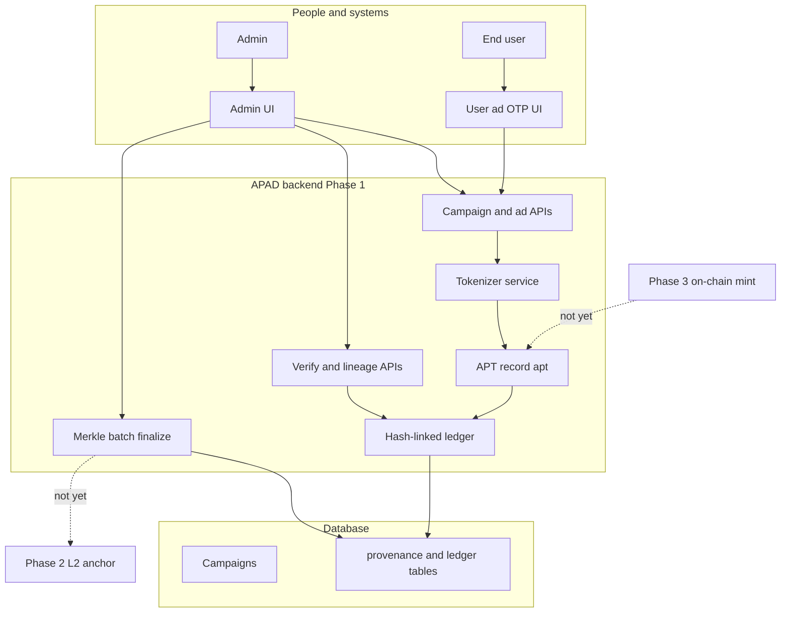
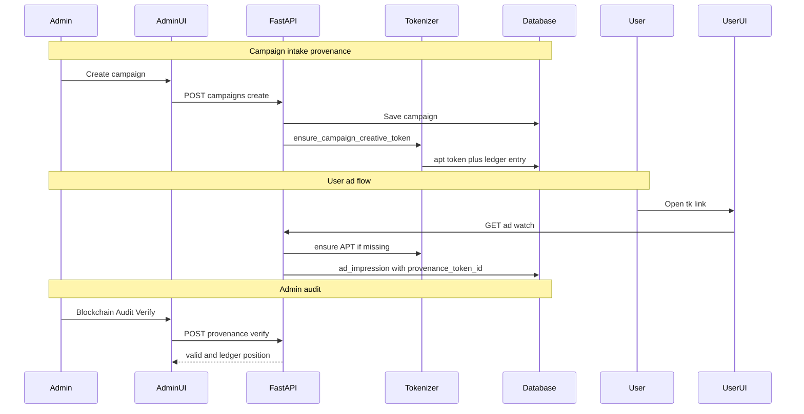
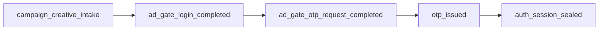
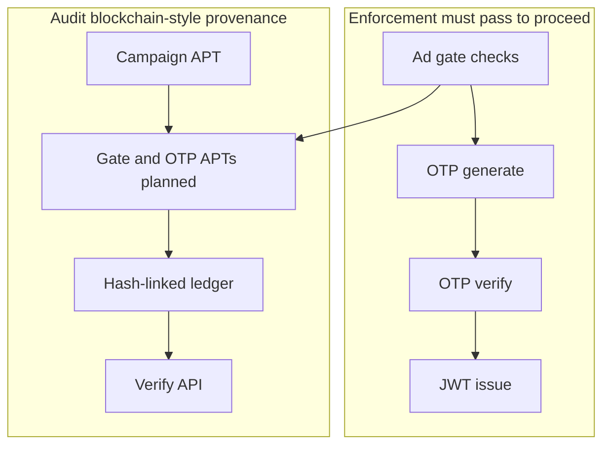

# APAD Provenance & Blockchain-Style Ledger — Overall Analysis

This document consolidates the **analysis only** (vision, phases, flows, benefits, security, and current vs target state) for APAD’s provenance layer. It does not replace the technical spec: see [APAD-Tokenization-Architecture-Spec.md](../APAD-Tokenization-Architecture-Spec.md).

---

## 1. What you are building

APAD is adding a **provenance and attribution engine**, not a payment system or user wallet.

**Core question it answers:**

> Where did this ad (and later this auth path) come from, was it changed, and can we verify that without relying only on “trust our database”?

Each protected value is wrapped in an **Advertisement Provenance Token (APT)** — `apt_...`. The token does **not** store the video or OTP; it stores:

- A **SHA3-512 fingerprint** (`content_hash`) of canonical metadata
- **Source** (`source_id`), **stage** (pipeline or flow step), **parent** (`parent_token_id`) for lineage
- A **ledger anchor** into a private hash-linked log
- Optional hybrid signatures (`sig_classical`, `sig_pqc`) per the full spec (verification not fully wired yet)

**Naming in the live app:**

| ID | Purpose |
|----|---------|
| `tk_...` | Personalized **ad delivery** link (watch / OTP gate) |
| `apt_...` | **Audit / chain-of-custody** proof for creative (and planned auth steps) |

---

## 2. Three-phase roadmap (brief)

### Phase 1 — Custom ledger core

Private, permissioned, **hash-linked ledger** inside APAD: fast, no gas, hashes/metadata only (HIPAA-friendly). Delivers identity binding, integrity, and lineage for campaign creatives; verification API and admin audit UI.

### Phase 2 — Public anchoring

Batch ledger entries into a **Merkle root** and periodically anchor that root on an **Ethereum L2** (e.g. Base, Arbitrum). Only an opaque root on-chain — no PHI, no creative URLs, no OTP.

### Phase 3 — Selective on-chain tokens

For deliverables or audits that need **external verification**, mint EVM provenance records (permissioned or L2): hashes and metadata on-chain, media and secrets off-chain, hybrid signatures in payload.

**One line:** Phase 1 = private proof chain → Phase 2 = anchor summaries to L2 → Phase 3 = optional on-chain tokens for high-value / external audit cases.

---

## 3. Phase 1 — what is implemented today (campaigns)

### 3.1 Components

- **Models:** `provenance_sources`, `provenance_tokens`, `ledger_entries`, `merkle_batches`
- **Services:** SHA3-512 hashing, tokenizer, hash-linked ledger append, verify full chain, Merkle batch finalize
- **APIs (admin):** intake, transform, lineage, verify, list campaigns with APT, finalize Merkle batch
- **Integration:** New campaigns auto-create APT (`campaign_creative_intake`); ad watch/completion and generated links carry `provenance_token_id`; lazy APT for older campaigns on ad watch
- **UI:** Admin → **Blockchain Audit** (`/admin/blockchain`)

### 3.2 Phase 1 gaps (vs full spec)

- Ed25519 + ML-DSA **sign/verify** not enforced (fields exist; verifier checks hashes and ledger only)
- Media pipeline stages (Nano / Veo / Synthesia / etc.) not in app yet — use transform API when they exist
- Creative fingerprint is **campaign metadata/URLs**, not downloaded MP4 bytes
- **Login / OTP lineage APTs** — designed, not fully implemented in code (see §7)

### 3.3 Merkle batches

Local Merkle roots are produced with `anchor_status: pending`. **On-chain anchoring is Phase 2.**

---

## 4. Visual — Phase 1 scope (big picture)



---

## 5. Visual — end-to-end flow (campaigns, beginning to now)



---

## 6. Example — why this matters (campaign)

1. **Apollo Clinic** campaign is created in APAD (video URL, title, etc.).
2. Backend creates **`apt_7f3a9c...`** and ledger entry — fingerprint of that creative **at intake**.
3. User **Ravi** uses **`tk_abc123`** (delivery only); analytics attach **`provenance_token_id`** on watch/complete.

**Three months later:** “Did users see **our approved** video, or was the URL swapped?”

- **Without provenance:** Logs show “campaign 12” but not that post-approval fields were unchanged.
- **With Phase 1:** Admin runs **Verify** on `apt_7f3a9c...` — token hash matches ledger; full chain intact. A silent URL change without a new APT breaks consistency or requires visible new lineage.

**One sentence for stakeholders:** Phase 1 gives each campaign creative a verifiable “birth certificate” and append-only audit trail inside APAD.

---

## 7. Extension — same model for login → OTP (target, not fully built)

User path (see [APPLICATION_FLOW.md](../APPLICATION_FLOW.md)):

```text
Login → Ad 1 (login gate) → Generate OTP → Ad 2 (otp_request gate) → send-otp → verify-otp → JWT
```

**Goal:** Prove OTP was issued **after** ad gates, for this user/session/campaign, with **tamper-evident** history — same ledger and three phases as campaigns.

### 7.1 Proposed lineage (one tree)

| Step | Stage | Parent | Hashed content (never plaintext OTP) |
|------|-------|--------|--------------------------------------|
| Creative | `campaign_creative_intake` | — | Campaign metadata (done) |
| Ad 1 done | `ad_gate_login_completed` | campaign APT | user ref, gate, watch, campaign_id |
| Ad 2 done | `ad_gate_otp_request_completed` | previous | same, gate=otp_request |
| OTP sent | `otp_issued` | OTP-gate APT | otp_log_id, expires_at, provider, campaign apt_id, tk |
| OTP OK | `auth_session_sealed` | otp_issued | otp_log_id, status=verified, time |

**Security rule:** Do **not** put OTP digits, JWT, or full mobile on the ledger. Use `otp_log_id`, hashed mobile, and session refs.

### 7.2 OTP example (audit)

*“Was OTP sent without watching the sponsored message?”*

Lineage must be: `campaign APT → … → otp_gate → otp_issued`. Missing or broken chain → policy violation or tampering signal.

### 7.3 OTP flow (target Phase 1)



Phases 2–3: OTP APTs are **additional ledger rows** in the **same** Merkle batches and L2 anchors as campaign proofs.

---

## 8. Benefits of the blockchain-style approach

| Benefit | Meaning for APAD |
|---------|------------------|
| **Integrity** | Editing old records breaks hash chain → Verify fails |
| **Lineage** | Single reconstructable chain: creative → gates → OTP (when built) |
| **Audit / compliance** | Stronger than screenshots or editable logs alone |
| **External trust (later)** | Phase 2 L2 root; Phase 3 selective on-chain proofs |
| **Privacy** | Hashes and metadata only — not PHI, not OTP, not full media on public chain |

It does **not** replace Twilio, JWT, or normal SQL. It **adds** verifiable audit on top.

---

## 9. Current approach vs blockchain-style approach

### 9.1 Current (operational)

- Campaigns, `tk_` links, `otp_logs`, analytics events
- **Trust model:** “Our database says so.” Rows can be updated; logs are not hash-chained.

**Good for:** running the product, OTP, dashboards.  
**Weaker for:** proving history was not rewritten; proving OTP followed gates to a third party.

### 9.2 Blockchain-style (Phase 1+)

- Same user flows plus **APT** + **ledger** + **Verify** + optional Merkle batch
- **Trust model:** Tamper-evident internal chain; Phase 2+ external anchor

| Question | Current | Provenance |
|----------|---------|------------|
| User got OTP? | `otp_logs`, analytics | Same + (planned) chained APTs |
| Approved creative? | Latest DB row | Frozen **content_hash** at intake |
| URL changed in DB? | New URL shown | Old APT won’t match unless new token |
| History edited? | Possible with DB access | Breaks ledger chain |
| Outside world trust | DB export | Phase 2 anchored Merkle root |

---

## 10. Security and authentication

### 10.1 Provenance is not login

Authentication remains:

- Ad gate checks before `send-otp`
- OTP validation (app DB or Twilio Verify)
- JWT after verify

The ledger does **not** replace OTP or JWT.

### 10.1 Two layers



- **Enforcement:** blocks bad requests in real time.
- **Audit:** detects after-the-fact tampering; supports compliance and forensics.

### 10.2 What provenance helps for auth security

- Evidence that **auth path** (ads → OTP → session) was recorded in order
- **Tamper detection** on those records
- **Binding** auth events to **campaign/creative** proof
- **Future:** signed intake, L2 anchors for third-party audit

### 10.3 What it does not fix

| Threat | Provenance |
|--------|------------|
| SMS intercept / stolen OTP | No — TTL, rate limits, Twilio |
| OTP brute force | No — app limits |
| Stolen JWT | No — HTTPS, JWT policy |
| Bypass API without watching ad | Blocked by app, not ledger |
| Store OTP on chain | **Never** |

---

## 11. Phase mapping summary

| Phase | Campaigns | Login / OTP |
|-------|-----------|-------------|
| **1** | Creative APT, ledger, verify, admin UI | Planned: gate + OTP lifecycle APTs chained to campaign APT |
| **2** | Merkle → L2 anchor | Same batches include OTP ledger entries |
| **3** | Selective on-chain creative proof | Optional sealed auth audit bundle (hashes only) |

---

## 12. Demo Phase 1 (campaigns)

1. Admin login → create or select campaign (new → auto APT).
2. **Admin → Blockchain Audit** (`/admin/blockchain`).
3. Legacy campaigns: **Create APT Proof**.
4. **Verify** → ledger chain valid.
5. **Finalize Merkle Batch** → root in DB (`anchor_status: pending` until Phase 2).

API reference: Swagger `/docs`, tag **provenance**.

---

## 13. Related documents

| Document | Role |
|----------|------|
| [APAD-Tokenization-Architecture-Spec.md](../APAD-Tokenization-Architecture-Spec.md) | Full technical spec, APT schema, dual signatures |
| [blockchain_basics.md](./blockchain_basics.md) | General blockchain concepts |
| [ETHEREUM_BLOCKCHAIN_REQUIREMENTS.md](./ETHEREUM_BLOCKCHAIN_REQUIREMENTS.md) | Phase 2/3 infra checklist |
| [APPLICATION_FLOW.md](../APPLICATION_FLOW.md) | User login and OTP gates |

---

*Analysis document — campaigns Phase 1 implemented; OTP provenance chain planned per §7.*
